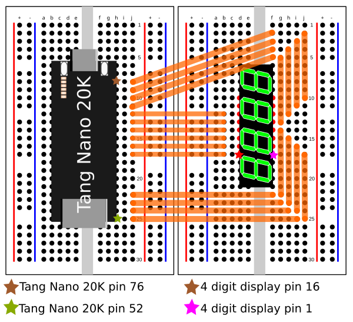

# Gowin FPGA Stopwatch (TangNano20k version)

 
 Verilog codes for a stopwatch project using the Tang Nano 20k. LED clock display used is the **Common Cathode** pinout. This is for the GW2AR-LV18QN88PC8/I7 FPGA developement board with TDCG1060m 7 LED Segment display.
 
# Pin connection (Please refer to 7 Segment LED clock display datasheet)
Use the following suggested layout with two half breadboards stuck together:

 
# Some dev notes
 * Each `always` block operates asynchronously, meaning that any codes nested within an `always` will run in parallel/simultaneously with other existing `always`. Hence this creates a runtime limitation that prevents any assignments (e.g. x = 1'b1;) of the same parameter to happen in separate `always` block during runtime. Question, which parallel/simultaneous process will have priority over the assignment?
 * When an `always` statement includes more than 1 condition, e.g. `always @ (posedge sys_clk or posedge sys_rst_n)`, said `always` block requires at least one `if` statement with either condition to be nested within the block.
 * There are two types of bitwise shift operator, `>>>` and `>>` (`<<<` and `<<` for reverse direction). Triple brackets are arithmetic shift where as double brackets are logical shifts. The `>>>` operator is unique from the other shift operator ( `<<<`, `<<` and `>>`), where by it will fill the left side of a **signed** parameter with a copy of the left most bit value, e.g. `4'b1011 >>> 1; //becomes 4'b1101 after shift`. The other shift operator simply fills the first or last bit with 0, depending on which shift direction.
 * Tang Nano 20k uses a 27 Mhz crystal oscillator, meaning its clock speed is basically 27 million pulses. Hence, a clock pulse counter that resets at 2.7 million pulses is equivalent to 0.1 seconds.

# Useful links for further study
 * https://www.chipverify.com/verilog/verilog-tutorial (General starting point)
 * https://www.asic-world.com/verilog/veritut.html (Intermediate and detailed guide, good for code reference)
 * https://wiki.sipeed.com/hardware/en/tang/tang-nano-20k/nano-20k.html (Tang Nano wiki)
 * https://www.vishay.com/doc/?83180= (PDF of 7 Segment LED clock display datasheet)
